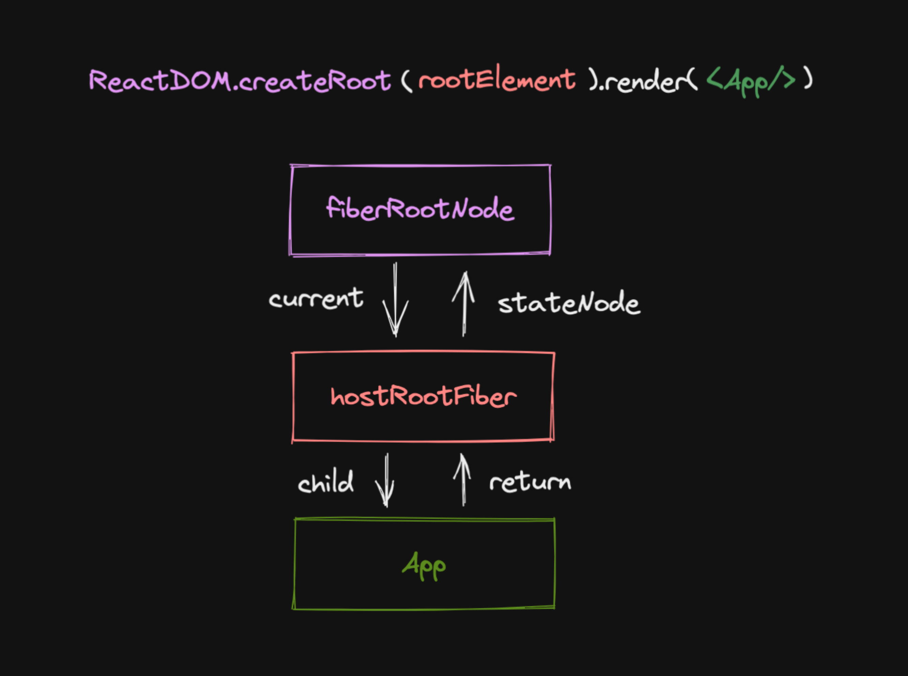

逐步构建 react
8.24 构建 jsx
9.3 打包流程
9.4
使用 pnpm link 调试自己的 react 代码
构建 Reconciler 协调器
Reconciler 协调器控制 Fiber 节点进行递归比较（DIFF 算法递归，DFS 深度优先）【递 beginWork 归 completeWork】，构建新的 Fiber 树，最后和当前 Fiber 树进行比较，这叫双缓冲技术(两个 Fiber 树)；
根据 ReactElement 和 FiberNode 进行比较【二者都是存储数据】产生标记（插入，移动...）,生成子 FiberNode，不断递归直到生成新的 Fiber 树；
Fiber 节点（虚拟 DOM）作为 ReactElement 节点和真实 UI 节点之间的数据结构；负责给 Reconciler 协调器表示节点关系；
9.6 state 发生变更时更新页面；定义一个数据结构 Update 表示 this.setState 调用时的更新动作；需要支持对象和函数两种参数 this.setState({}) this.setState((prevState)=>{})
Update 放入 UpdateQueue【队列】中用于排队更新

更新机制->由触发更新的节点（setState）向上找到根节点，初始化创建 updateQueue；从根节点开始递归生成新的 FiberTree【workInProgress】
